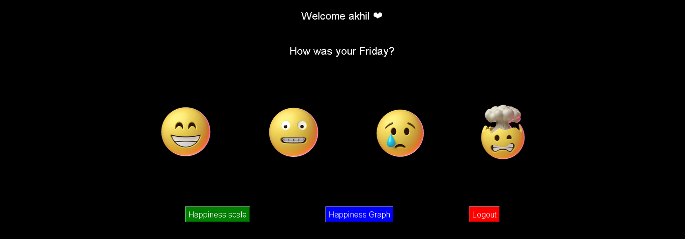

# 🌟 Office Mood Tracker



## 📝 Overview

The **Office Mood Tracker** is a Python-based application that allows users to log their daily moods and view their happiness trends over time. This application uses Tkinter for the graphical interface, Firebase for storing mood data, and Matplotlib for visualizing mood trends.

## 🚀 Features

- 🎭 **Mood Logging**: Choose from various animated emojis to record your mood.
- 📊 **Happiness Scale**: Get an instant happiness scale rating out of 10 based on your recent mood entries.
- 📈 **Happiness Graph**: Visualize your mood trends over the past 7 days with a beautifully styled graph.
- 👤 **User Login**: Secure user login with predefined usernames.
- 🖼️ **Full-Screen Mode**: The app runs in full-screen mode with an easy escape to windowed mode.

## 🛠️ Setup & Installation

### 1. Clone the Repository
```
git clone https://github.com/akhiljithvg/moodtracking.git
```

### 2. Install Python and Dependencies

Ensure you have Python 3.x installed on your system. You can download it from the official Python website.

#### Once Python is installed, create a virtual environment (optional but recommended):
```
python -m venv moodtracker-env
source moodtracker-env/bin/activate   # On Windows, use `moodtracker-env\Scripts\activate`
```

#### Install the required Python libraries:
```
pip install -r requirements.txt
```
### 3.Firebase Setup

   **Create a Firebase Project**:
   - Go to the [Firebase Console](https://console.firebase.google.com/).
   - Create a new project or use an existing one.

   **Set Up Firebase Authentication**:
   - In the Firebase Console, navigate to the "Authentication" section.
   - Enable Email/Password authentication (or other authentication methods as required).

   **Set Up Firebase Database**:
   - In the Firebase Console, navigate to the "Firestore Database" or "Realtime Database" section.
   - Set up your database in test mode for development purposes.

   **Download Firebase Admin SDK JSON File**:
   - Go to the "Project Settings" in the Firebase Console.
   - Under "Service Accounts," generate a new private key.
   - Download the `firebase_adminsdk.json` file.

   **Add Firebase Configuration**:
   - Place the downloaded `firebase_adminsdk.json` file in the `firebase_config/` directory within the project.

### 4. Run the Application
```
python mood_tracker.py
```

## 🧠 How It Works
**Login**: Users enter their username to access the mood tracker. Only allowed users can proceed.

**Select Mood**: Users can log their mood by clicking on animated emojis (😊 😐 😢 😡).

**View Reports**: After logging the mood, users can view their happiness scale or graph to see trends over time.

## 🖼️ User Interface
### Mood Selection

The app features a simple and intuitive interface with animated GIFs representing different moods. Just click on the emoji that best represents your mood!

### Happiness Scale

The happiness scale gives a quick overview of your overall happiness, with a pointer indicating your position on the scale.

### Happiness Graph

The graph shows a weekly overview of your mood, with emojis visually representing each day's mood.

## 📦 Project Structure

```
.
├── emojis/             # Directory containing mood GIFs
├── firebase_config/    # Firebase configuration files
├── resources/          # Static resources like images
├── mood_tracker.py     # Main application script
├── requirements.txt    # Python dependencies
└── README.md           # This file
```

## 🎨 Aesthetic Choices

**Background**: The app uses a sleek black background for a modern look.

**Colors**: Buttons and text are designed with high contrast to ensure readability.

**Full-Screen Mode**: The app is optimized for full-screen, creating an immersive user experience.


## 🔥 Technologies Used
**Python 🐍**

**Tkinter for GUI 🖼️**

**Firebase for Database 🔥**

**Matplotlib for Visualization 📊**

**PIL for Image Handling 🖼️**


## 🏆 Future Enhancements
Add a feature to track moods over longer periods (monthly/yearly).

Implement a way to export mood data to CSV or PDF.

Integrate with calendar APIs to auto-log moods.


## 💬 Feedback
Feel free to submit issues or pull requests if you find any bugs or have suggestions for improvements. Contributions are always welcome! 🎉


## 📄 License
This project is licensed under the MIT License - see the LICENSE file for details.


### Developed with ❤️ by Akhiljith Gigi
